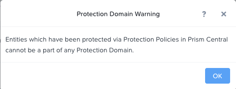

.. _data_protection:

Data Protection
***************

Nutanix สามารถทำการปกป้องข้อมูล ด้วยการทำ storage snapshot ในระดับ VM/vDisk ซึ่งจะมี Protection Domains (PDs) ที่เป็นการสร้างกลุ่มของ VM ที่ต้องการปกป้องข้อมูล โดยสามารถกำหนด policy ของ snapshot และ replication ตามที่ต้องการให้กับกลุ่ม VM นั้นๆ.

ใน Exercise นี้ เราจะใช้ Prism ในการ create และ restore จาก VM snapshots และยังสร้าง Protection Domain สำหรับทำการปกป้องข้อมูล VM ของเราด้วย.

VM Snapshots
------------

#. ใน **Prism Element > VM > Table**, เลือก *Initials*-**Linux_VM** ที่สร้างไว้.

#. คลิกที่ **Snapshot** จาก Action list ด้านล่าง.

#. กำหนดชื่อ snapshot แล้วคลิก **Submit**.

#. ไปที่แท็ป **VM Snapshots** ที่อยู่ด้านล่าง เพื่อตรวจสอบ snapshot ของ VM นั้นๆ.

   .. figure:: images/manage_workloads_04.png

#. ภายใต้ **Actions**, คลิกที่ **Details** เพื่อดูคุณสมบัติต่างๆ ของ VM ทั้งหมด ณ เวลาที่ทำการ snapshot.

   *ถึงเวลา ทำลาย VM แล้ว!*

#. ให้ทำการปิด VM นั้น โดยกด Power Off Actions > Power Off (หากเราไม่ปิดเครื่องก่อนเราจะไม่สามารถลบ devices ได้)

#. คลิก **Update** เพื่อจะทำการแก้ไข resource ของตัว VM โดยทำการลบ CD-ROM และ DISK ออกด้วยการกด **X** icon ของแต่ละชิ้น.

#. คลิก **Save**.

#. ลอง power on และเปิดหน้า console ของ window.

   .. note:: 
     เนื่องจาก VM นี้ ไม่มี disk ที่ใช้ในการบูทเข้า OS อีกแล้ว ฉะนั้น หน้าจอ console เลยแสดงเป็นหน้าเกมส์ 2048 ขึ้นมาแทน

#. ภายใต้แท็ป **VM Snapshots**, เลือก snapshot ที่ต้องการแล้วคลิก **Restore** เพื่อที่จะกู้คืน VM นี้ให้กลับไปอยู่ในสถานะก่อนหน้าเหมือนตอนที่ทำ snapshot นี้ขึ้นมา.

   หรืออีกทางเลือกนึง เราสามารถทำการกด **Clone** เพื่อทำการ restore ขึ้นมาเป็น VM เครื่องใหม่.

#. ตรวจสอบว่า VM สามารถบูทขึ้นมาเข้า OS ได้อย่างสมบูรณ์.

อย่างที่กล่าวไว้ก่อนหน้านี้ Nutanix snapshots ใช้วิธีการทำแบบ `redirect-on-write <https://nutanixbible.com/#anchor-book-of-aos-snapshots-and-clones>`_ approach that does not suffer from the performance degradation of chained snapshots found in other hypervisors.

Protection Domains
------------------

#. ใน **Prism Element > Data Protection > Table**, คลิก **+ Protection Domain > Async DR** เพื่อสร้าง Protection Domain.

   .. note::

      Synchronous replication + Metro Availability ซัพพอร์ทบน ESXi เท่านั้น จะซัพพอร์ทบน AHV ในอนาคตอันใกล้นี้
      Synchronous replication ซัพพอร์ทบน ESXi และ AHV (5.17 or later) and will be supported in AHV in a future release.

#. เมื่อมีการใช้งาน Data Protection จะมีกล่องข้อความแสดงขึ้นมา. คลิกที่ปุ่ม **OK** เพื่อไปต่อ.

#. ตั้งชื่อสำหรับ PD แล้วกด **Create**.

#. เลือก VM ที่เราสร้างไปก่อนหน้าใน Lab นี้ เพื่อทำ Protection domain ของ VM นั้น โดยสามารถใช้ filter VM จากชื่อหรือจะเลื่อนหา VM ที่เราต้องการก็ได้.

#. คลิกที่ **Protect Selected Entities** แล้วทำการตรวจสอบ VM ที่ปรากฏขึ้นมาทางด้านขวามือ **Protected Entities**.

   **Consistency Groups** คือการที่เราสามารถจัดกลุ่มของหลายๆ VM ที่มีการทำ snapshot ในเวลาเดียวกันเข้าไว้ด้วยกัน เช่น กลุ่มของหลายๆ VM ที่เป็นของ application เดียวกัน ก็ทำการกำหนด snapshot policy เดียวกัน.

   .. note:: 
     การทำ snapshots ของ Nutanix สามารถทำ application consistent snapshots ได้บนระบบปฏิบัติการ OS ที่รองรับพร้อมด้วยต้องติดตั้ง NGT ลงบน VM และในแต่ละ VM ที่ใช้ application consistent snapshots จะอยู่ในส่วนของ consistency group ของมันเอง.

#. คลิก **Next**.

#. คลิก **New Schedule** เพื่อกำหนด Recovery Point Objective (RPO) และกำหนด retention.

#. ทำการกำหนดความถี่ในการทำ snapshot ที่ต้องการ เช่น ทำ snapshot ทุกๆ 1 ชั่วโมง

   .. note::

      AHV รองรับการทำ NearSync snapshots ด้วย RPO ต่ำสุดที่ 1 นาที.

   .. note::

      เราสามารถกำหนดหลายๆ schedules อยู่ใน PD เดียวกันได้ ซึ่งทำให้เราสามารถทำและเก็บ snapshot/retention ได้หลายๆ version ในแบบทุกชั่วโมง, ทุกวัน, ทุกเดือน ตามที่เรากำหนด.

#. ทำกำหนดจำนวน retention policy ในการเก็บ snapshot เช่น เก็บ 5 snapshot ล่าสุด

   .. note::

      สำหรับการกำหนดของตัว remote cluster นั้น สามารถกำหนดการทำ replication ได้ง่ายๆ โดยการกำหนดจำนวนของ snapshot ที่ต้องการเก็บในแต่ละ remote site.

      .. figure:: images/snapshot_02.png

#. คลิก **Create Schedule**.

#. คลิก **Close** เพื่อออก.

เพียงแค่เท่านี้เอง เราก็เสร็จสิ้นการสร้าง native data protection ของ Nutanix เองภายใต้หน้า Prism แล้ว

สามารถเรียนรู้เพิ่มเติมเรื่อง **Backup and Disaster Recovery** `ได้ที่นี่ <https://nutanixbible.com/#anchor-book-of-aos-backup-and-disaster-recovery>`_.

